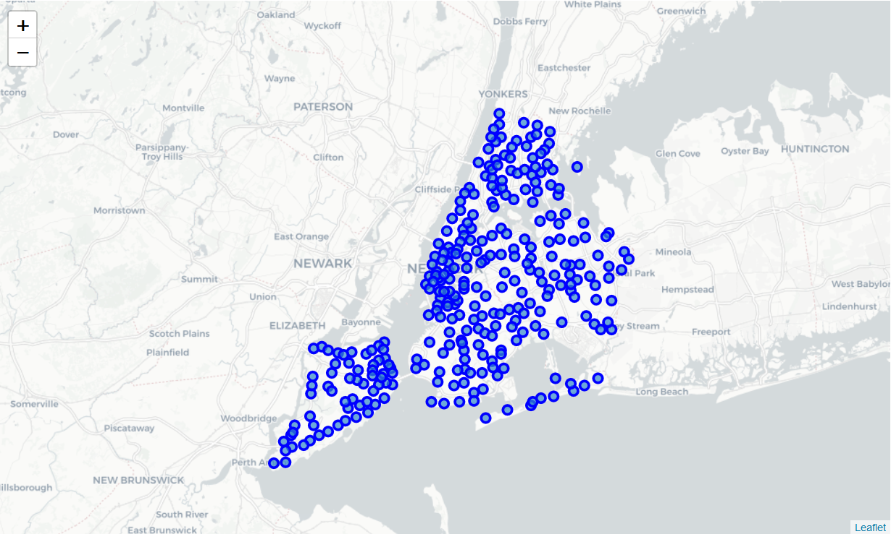
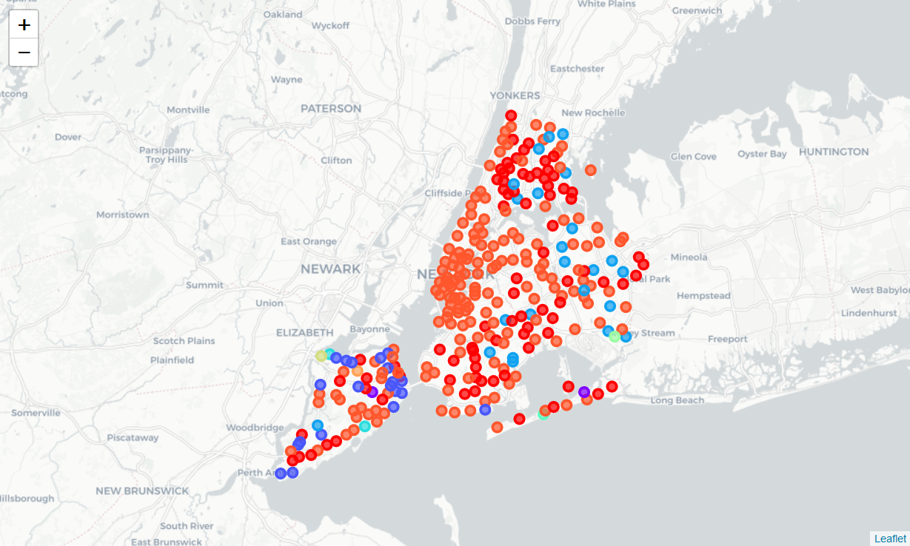
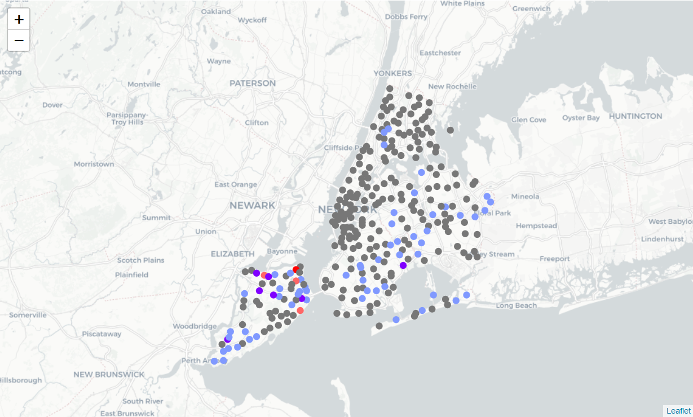

# 
Automatic Neighborhood Recommendation

<cite>Carlos Daniel</cite> [@_cdCarlos_](https://twitter.com/_cdCarlos_)

<cite>26/Feb/2019</cite>

- [Automatic Neighborhood Recommendation](#automatic-neighborhood-recommendationcenter)
    - [Introduction](#introduction)
        - [Problem](#problem)
    - [Data](#data)
        - [Data Sources](#data-sources)
        - [Data Pre-Processing](#data-pre-processing)
            - [NY Neighborhoods Location](#ny-neighborhoods-location)
            - [NY Venues](#ny-venues)
            - [Categorical Features Encoding](#categorical-features-encoding)
    - [Clustering](#clustering)
    - [Neighborhood Recommendation](#neighborhood-recommendation)
        - [Similarity Level](#similarity-level)
    - [Results and Discussion](#results-and-discussion)
    - [Conclusion](#conclusion)

## Introduction

I am going to analyze a study case for real state companies. In this work are discussed some of the challenges companies in this sector may face and the repercussions at operational cost and customer satisfaction.

Also, I show up how Data Science techniques such as data pre-processing and cleaning, visualization and clustering algorithms can help solving this kind of problems in this prove of concept project.

### Problem

A company dedicated to the rent and sale of real estate housing wants to reduce the operational cost in the process of recommending neighborhoods for their customers while improving their response time.

Employees have to look for neighborhoods at a given city that satisfy some given characteristics where customers are used to live (or willing to). This process can required many hours even for experienced employees who have to analyze and evaluate all of those characteristics provided by the customer, resulting in not just a costly operation for the company but also in a long wait time period for customers in order to get some recommendations.

For our study case we are going to simulate a customer who lives in a random neighborhood of Toronto, CA and is willing to move to New York City, US. As customer can provide as many desired characteristics for expected neighborhoods, in this case we are going to limit those characteristics to venues.

## Data

This project requires different kinds of data such as location data and venues information for each selected city and its corresponding neighborhoods.

Location Information:

* Neighborhoods in Toronto.
* Neighborhoods in New Yor City.

Venues Information:

* Venues for each neighborhoods in Toronto.
* Venues for each neighborhoods in New York.

### Data Sources

I used the data sets for Toronto and NY from the following sources:

* [New York City Open Data](https://data.cityofnewyork.us/City-Government/Neighborhood-Names-GIS/99bc-9p23): Location data.
* [Toronto Most Common Venues](https://github.com/cdCarlos/coursera_capston/blob/master/toronto_common_venues.csv): Location data.
* [Foursquare API](https://developer.foursquare.com/): Venues data

In contrast to Toronto, I had to consolidate first the data set for NY.

### Data Pre-Processing

Toronto's dataset already have all the information required for the analysis. NY's dataset in the other hand required extra work in order to get the data ready to start working.

#### NY Neighborhoods Location

Cleaning up the NY neighborhoods coordinates was one of the first steps in the cleaning process. The original location information was encoded in geometry point format and I had to split up the Latitude and Longitude coordinates generating a feature for each one of them.

Once I have the coordinates I was able to remove all of the unnecessary features and keep only the borough name, neighborhood name, latitude and longitude features.

At this point I was able to take a look at the New York neighborhoods.

Now I was ready for the

#### NY Venues

In order to get venues details for each neighborhood in NY I used the [Foursquare API](https://developer.foursquare.com/) where I had to create first a developer account.

For each neighborhood I consumed the Foursquare API to fetch the venues information in a radius of 500 meters with a limit of 100 venues per neighborhood.

Results from API are in JSON format, so, I had to parsed and filtering out venue name, category and locations information as middle step.

This is how our dataset looks like:

| Neighborhood | Neighborhood Latitude | Neighborhood Longitude | Venue                | Venue Latitude | Venue Longitude | Venue Category |
|--------------|-----------------------|------------------------|----------------------|----------------|-----------------|----------------|
| Wakefield    | 40.894705             | -73.847201             | Lollipops Gelato     | 40.894123      | -73.845892      | Dessert Shop   |
| Wakefield    | 40.894705             | -73.847201             | Rite Aid             | 40.896521      | -73.844680      | Pharmacy       |
| Wakefield    | 40.894705             | -73.847201             | Carvel Ice Cream     | 40.890487      | -73.848568      | Ice Cream Shop |
| Wakefield    | 40.894705             | -73.847201             | Dunkin Donuts        | 40.890631      | -73.849027      | Donut Shop     |
| Wakefield    | 40.894705             | -73.847201             | SUBWAY               | 40.890656      | -73.849192      | Sandwich Place |

#### Categorical Features Encoding

Working with categorical data is hard an can lead to misleading results specially when using clustering algorithms such as K-Means where euclidean distance (or equivalent) is used to calculate the clusters.
To fix this, I encoded categorical features using OneHot Encoding technique.

We can easily defined OneHot Encoding as "a process by which categorical variables are converted into a form that could be provided to ML algorithms to do a better job in prediction".
In other words, we perform "binarization" of each category and include each one of them as a new feature in our dataset.

In this case I'm interested in the venue's category feature. For example, if we have a dataset like this:

| Venue                | Venue Category |
|----------------------|----------------|
| Lollipops Gelato     | Dessert Shop   |
| Rite Aid             | Pharmacy       |

After applying OneHot Encoding, we should ended up with something like this:

| Venue                | Dessert Shop   | Pharmacy       |
|----------------------|:--------------:|:--------------:|
| Lollipops Gelato     | 1              | 0              |
| Rite Aid             | 0              | 1              |

In addition to apply OneHot Encoding to the NY venues dataset, I calculate the mean of each venue's category (now a feature) in order to properly rank the venue's popularity by category. So, the result is as follows:

| Neighbourhood | ATM | Accessories Store | Adult Boutique | Afghan Restaurant | African Restaurant | Airport Terminal | Airport Tram | American Restaurant | Animal Shelter | ... | Waste Facility | Watch Shop | Waterfront | Weight Loss Center | Whisky Bar | Wine Bar | Wine Shop | Wings Joint | Women's Store | Yoga Studio |
| --- | --- | --- | --- | --- | --- | --- | --- | --- | --- | --- | --- | --- | --- | --- | --- | --- | --- | --- | --- | --- |
| Wakefield | 0 | 0 | 0 | 0 | 0 | 0 | 0 | 0 | 0 | ... | 0 | 0 | 0 | 0 | 0 | 0 | 0 | 0 | 0 | 0 |
| Wakefield | 0 | 0 | 0 | 0 | 0 | 0 | 0 | 0 | 0 | ... | 0 | 0 | 0 | 0 | 0 | 0 | 0 | 0 | 0 | 0 |
| Wakefield | 0 | 0 | 0 | 0 | 0 | 0 | 0 | 0 | 0 | ... | 0 | 0 | 0 | 0 | 0 | 0 | 0 | 0 | 0 | 0 |
| Wakefield | 0 | 0 | 0 | 0 | 0 | 0 | 0 | 0 | 0 | ... | 0 | 0 | 0 | 0 | 0 | 0 | 0 | 0 | 0 | 0 |
| Wakefield | 0 | 0 | 0 | 0 | 0 | 0 | 0 | 0 | 0 | ... | 0 | 0 | 0 | 0 | 0 | 0 | 0 | 0 | 0 | 0 |
| ... | ... | ... | ... | ... | ... | ... | ... | ... | ... | ... | ... | ... | ... | ... | ... | ... | ... | ... | ... | ... |

At this point I was able to get the 10 most common venues for each neighborhood:

| Neighbourhood | 1st Most Common Venue | 2nd Most Common Venue | 3rd Most Common Venue | 4th Most Common Venue | 5th Most Common Venue | 6th Most Common Venue | 7th Most Common Venue | 8th Most Common Venue | 9th Most Common Venue | 10th Most Common Venue |
| --- | --- | --- | --- | --- | --- | --- | --- | --- | --- | --- |
| Annadale | Sports Bar | Restaurant | Dance Studio | Pizza Place | Cosmetics Shop | Liquor Store | Diner | Train Station | Yoga Studio | Fast Food Restaurant |
| Arden Heights | Pharmacy | Deli / Bodega | Pizza Place | Coffee Shop | Bus Stop | Fish & Chips Shop | Eye Doctor | Factory | Falafel Restaurant | Farm |
| Arlington | Bus Stop | Deli / Bodega | Food Service | Grocery Store | Fish Market | Factory | Falafel Restaurant | Farm | Farmers Market | Fast Food Restaurant |
| Arrochar | Deli / Bodega | Bus Stop | Italian Restaurant | Mediterranean Restaurant | Middle Eastern Restaurant | Sandwich Place | Liquor Store | Bagel Shop | Hotel | Pizza Place |
| Arverne | Surf Spot | Metro Station | Pizza Place | Donut Shop | Sandwich Place | Beach | Playground | Thai Restaurant | Bed & Breakfast | Board Shop |

## Clustering

For clustering, I used K-Means from sklearn package. K-Means is one of the simplest, fast and robust algorithm for unsupervised learning clustering and it also works really well with large datasets.
In this case I defined 10 clusters.

As you can see multiple neighborhoods fall into the same cluster.

## Neighborhood Recommendation

Now everything is set to the recommendation phase. The first step here is to choose the random customer information.
What I mean by customer information is ranked venues where customer is used to live since this information will be
recommendation criteria for the new location.

**Random customer information:**
* PostalCode: M3K
* Borough: North York
* Neighbourhood: CFB Toronto, Downsview East
* 1st Most Common Venue: Bus Stop
* 2nd Most Common Venue: Park
* 3rd Most Common Venue: Airport
* 4th Most Common Venue: Yoga Studio
* 5th Most Common Venue: Dumpling Restaurant
* 6th Most Common Venue: Discount Store
* 7th Most Common Venue: Dog Run
* 8th Most Common Venue: Doner Restaurant
* 9th Most Common Venue: Donut Shop
* 10th Most Common Venue: Drugstore

The important information here are the ten venues that most represent the location where customer is used to live.

### Similarity Level

Here we are going to use the term **Similarity Level** (SL) which is explained next.

Either for Toronto and NY we have their ten most common venues. These venues are ordered starting at 1 to 10 being 1 the first one most representative, 2 the second one most representative and so on for the neighborhood. This is our similarity level.

In our case we recommend a NY neighborhood based on the Similarity Level it has with the customer's neighborhood. For instance, a recommended NY neighborhood with a SL equals to 3 means that the NY neighborhood has a perfect match with the 1st, 2nd and 3th customer's most common venues.

With this information I was able to extract those NY neighborhoods with the highest SL score:

| SL | Venue Type | Neighborhoods |
| --- | --- | --- |
| 1 | Bus Stop | Starrett City, New Brighton, Woodrow, Arlington, Grasmere, Bulls Head, Elm Park, Willowbrook |
| 2 | Park | New Brighton |

A this point it is easier to have a look at the results:

## Results and Discussion

In the above map we can see the NY recommended neighborhoods. Here we have deferenciated some neighborhoods with different colors.

In this case, the intense red point represents the neighborhood with the highest SL to the actual customer's neighborhood.
The other three light red points are those neighborhoods that are part of the cluster where the intense red point belongs to (which makes them good cantidates for recommendation).

The same applies for the purple points. The seven intense purple points are those neighborhoods with a SL equals to 1 and the light purple points are those who belongs to the same cluster.

Gray points are neighborhoods with zero SL (not recommended).

Now we can recommend neighborhoods to customer in a more easy and fast way reducing the opeartional cost by the company.

## Conclusion

By using unsupervised clustering algorithms we were able to recommend specific neighborhoods but also whole clusters to our imaginary customer.

At this point we've done the prove of concept for a business problem reducing the operational cost and response time for recommending neighborhoods based on neighborhood's similarities were customer is used to live.

One next step should be our model's optimization by defining a proper clustering size based on F1-score, V-Measure, comparing performance between multiple unsupervised algorithms and so on.

